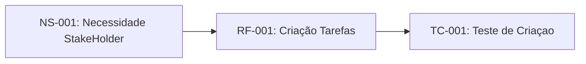

# Sistemas de Gestão de Tarefas

## 1 - Introdução

### 1.1 Propósito do Projeto

Este documento especifica os requisitos funcionais e não-funcionais para o Sistema de Gestão de Tarefas (SGT), seguindo o padrão IEEE 29148:2018.

### 1.2 Escopo

O SGT permitirá que usúarios criem, organizem e acompanhem tarefas pessoais e profissionais com sistemas de prioridade de prazos.

### 1.3 Definição e Acrônimos

- **SGT**: Sistema de Gestão de Tarefas
- **RF**: Requisitos Funcional
- **RNF**: Requisito Não-Funcional
- **Sprint**: Período de 2 semanas de desenvolvimento

### 1.4 Referências

- IEEE 29148:2018 - Systems and software engineering
- CMMI for Development. Version 2.0.

## 2 - Descrição Geral

### 2.1 Perspectiva do Produto

O SGT será uma aplicação web responsiva com sincronização em nuvens.

### 2.2 Funções Principais

- Criação e edição de tarefas (NS-001)
- Organização por projetos e tags
- Sistema de notificação
- Relatórios de produtividade

## 3 - Requisitos Específicos

### 3.1  Requisitos Funcionais

#### RF-001: Criação de Tarefas

**Descrição**: O sistema deve permitir que usuários criem tarefas com título, descrição, data de vencimento e prioridade.
**Prioridade**: Alta.
**Versão**: 1.0
**Data**: 2026-03-27
**Rastreabilidade**: Derivado da necessidade do stakeholder NS-001

**Critérios de Aceitação**:
- [ ] Formulário com Campos Obrigatórios (Título) e Opcionais
- [ ] Validação de data (Não permitir datas passadas)
- [ ] Nível de prioridade: Baixa, Média, Alta
- [ ] Confirmação Visual após criação

**Dependências**: Nenhuma

---

#### RF-002: Organização por Projetos

**Descrição**: O sistema deve permitir agrupar Tarefas em Projetos Personalizados
**Prioridade**: Média.
**Versão**: 1.0
**Data**: 2026-03-27
**Rastreabilidade**: Derivado da necessidade do stakeholder NS-002

**Critérios de Aceitação**:
- [ ] Usuários pode criar, renomear e excluir Projetos
- [ ] Tarefas podem ser atribuidas a um ou nenhum projeto
- [ ] Visualização filtrada por projeto

**Dependências**: RF-001

---

### 3.2 Requisitos Não-Funcionais

#### RNF-001: Desempenho

**Descrição**: O sistema deve carregar a lista de tarefas em menos de 1 segundo para até 100 tarefas.
**Categoria**: Desempenho.
**Prioridade**: Alta.
**Versão**: 1.0
**Métrica**: Tempo de Resposta < 1s para 95% das Requisições.

---

#### RNF-002: Segurança

**Descrição**: O Sistema deve implementar autenticação OAuth 2.0 e criptorafia TLS 1.3
**Categoria**: Segurança
**Prioridade**: Crítica.
**Conformidade**: LGPD, ECADigital.

---

## 4 - Controle de Versões

### 4.1 Histórico de Alterações

| Versão | Data | Autor | Modificação |
| ------ | ---- | ----- | ----------- |
| 1.0 | 2026-03-27 | Equipe de Análise | Versão inicial do Documento |

### 4.2 Rastreabilidade

Infográfico de Rastreabilidade do Requisito

